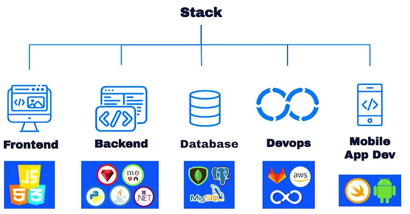

# Patrones de Diseño

## Categorías Principales

Los patrones de diseño se dividen en 3 categorías principales:

- **Patrones Creacionales**
- **Patrones Estructurales**
- **Patrones de Comportamiento**

## Importancia del Diseño de Software

### ¿Por qué es importante el Diseño de Software?

- El Diseño implica un <u>proceso de creación y desarrollo</u> para producir un nuevo objeto.
- Nuestro objeto es el <u>Software</u>.
- Diseñar Software implica pensar en un <u>modelo</u> que describa de la mejor forma posible cómo funcionará nuestra aplicación.

### Algunos elementos del diseño...

#### Arquitectura

#### Elección stack

